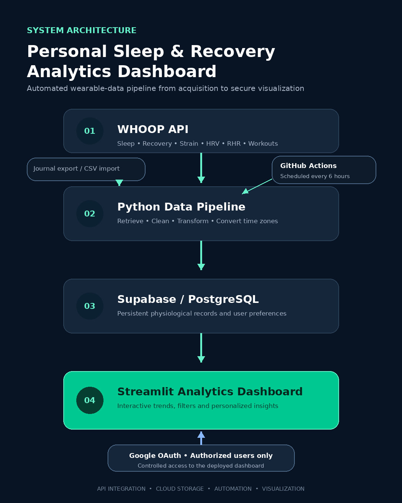
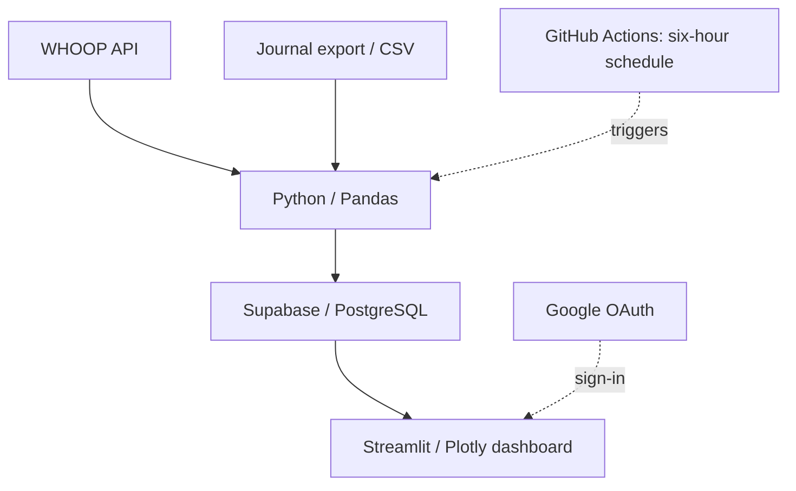

# Personal Sleep and Recovery Analytics Dashboard

An end-to-end wearable health analytics project that transforms WHOOP data into interactive insights about sleep, recovery, HRV, resting heart rate, physiological strain, workouts, and journal behaviors.

This repository is a **public showcase companion** to the project. Its newly written illustrative code uses synthetic data; it is not an extracted or audited copy of the private production application. Production features below describe the project, not features implemented in this small demo.



## Project overview

The production system retrieves wearable data through the WHOOP API, processes the records with Python and Pandas, stores them persistently in Supabase/PostgreSQL, and presents the results through a Streamlit dashboard. GitHub Actions schedules synchronization every six hours, while Google OAuth provides controlled dashboard access.

## Key features

The following describe the private project. The included demo implements overview metrics, recovery trends, sleep-duration/recovery and strain/next-cycle-recovery scatter plots, and 30/90/all-data filters only. It does not connect to WHOOP, authenticate users, store cloud data, or run scheduled syncs. Journal data comes from exports/imports; it is not assumed to come from the public API. Recommended bedtime is not promised as a public API field.

- Recovery, HRV, resting-heart-rate, sleep, strain, workout, and journal analytics
- 30-day, 90-day, custom-date, and complete-history filtering
- Sleep-duration, sleep-stage, sleep-consistency, and recovery analysis
- Daily-strain versus next-cycle-recovery comparison
- Timezone-aware processing and persistent user preferences
- Automated six-hour data synchronization in the production system
- Responsive Streamlit interface with interactive Plotly charts
- Google OAuth access control in the production deployment

## Technical stack

| Layer | Technologies |
|---|---|
| Data source | WHOOP API |
| Processing | Python, Pandas |
| Database | Supabase, PostgreSQL |
| Visualization | Streamlit, Plotly |
| Authentication | Google OAuth |
| Automation | GitHub Actions |
| Deployment | Streamlit Community Cloud |

## Repository contents

```text
whoop-sleep-recovery-dashboard/
├── app.py
├── data/
│   └── synthetic_whoop_data.csv
├── docs/
│   ├── DATA_PIPELINE.md
│   ├── FEATURES_AND_STACK.md
│   ├── INSTALLATION.md
│   ├── system-architecture.png
├── scripts/
│   ├── generate_architecture_diagram.py
│   ├── check_demo.py
│   └── generate_synthetic_data.py
├── src/
│   ├── __init__.py
│   └── data_pipeline.py
├── .env.example
├── .gitignore
├── requirements.txt
└── README.md
```

## Run the sanitized demo

```bash
python -m venv .venv
```

Activate the environment:

```bash
# Windows PowerShell
.venv\Scripts\Activate.ps1

# macOS/Linux
source .venv/bin/activate
```

Install dependencies and launch the application:

```bash
pip install -r requirements.txt
streamlit run app.py
```

The demo loads only the included synthetic dataset and does not require WHOOP, Supabase, or Google credentials.

## Data pipeline



See [Data-pipeline explanation](docs/DATA_PIPELINE.md) for a detailed breakdown.

## Environment configuration

The included `.env.example` contains placeholder variable names only. Never commit a populated `.env`, `.streamlit/secrets.toml`, WHOOP tokens, Supabase keys, Google OAuth credentials, email addresses, or personal health records.

## Privacy and repository scope

The following items are intentionally excluded from this public version:

- WHOOP access and refresh tokens
- Supabase service-role keys and production database identifiers
- Google OAuth secrets and authorized-user information
- Personal physiological data and journal responses
- Production authentication, synchronization, and deployment configuration

The production repository and live dashboard remain private because the system processes personal health data and uses authenticated integrations.

## Additional documentation

- [Features and technical stack](docs/FEATURES_AND_STACK.md)
- [Data-pipeline explanation](docs/DATA_PIPELINE.md)
- [Installation instructions](docs/INSTALLATION.md)

## Future development

These are possible directions, not implemented demo capabilities.

- Account-specific multi-user data isolation
- Improved mobile usability
- Personalized trend summaries and anomaly detection
- Predictive sleep and recovery modeling
- Deeper journal-behavior correlation analysis
- Configurable alerts for unusual physiological trends

## Disclaimer

This project is intended for personal analytics, education, and engineering demonstration. It is not a medical device and does not provide medical advice, diagnosis, or treatment.

Synthetic relationships are deliberately generated for visualization; they are not evidence of physiological effects or validated predictions. No official WHOOP affiliation is implied.

## Before publishing

Extract the ZIP and upload the contents into a new public showcase repository. Keep your existing production repository private. Review the production feature list against your current app; no private source was inspected when preparing this companion. Add your own redacted screenshots if desired. The proposed repository URL is not created by this package. No license has been selected; choose one deliberately before granting code reuse rights.

Official references: [WHOOP API](https://developer.whoop.com/api/), [Streamlit application testing](https://docs.streamlit.io/develop/api-reference/app-testing/st.testing.v1.apptest).
